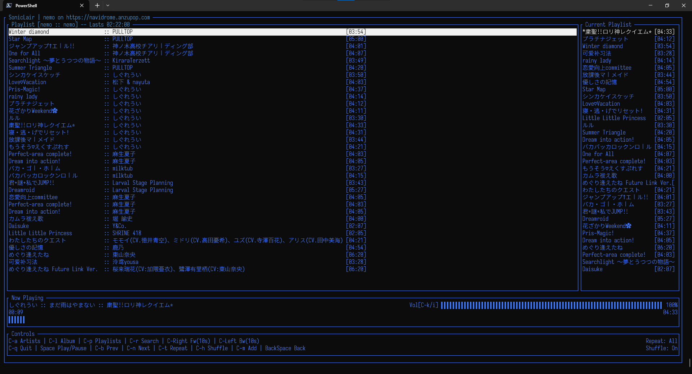

# Soniclair.Cli

[English](./README.md) [简体中文](./README.zh-CN.md)

<p align="middle">
   
</p>

## An album-centered subsonic client for the Terminal

SonicLair.Cli is a terminal music client for subsonic compatible music servers built using .NET Core 8, designed to be cross-platform (Windows, Linux and macOS). It's derived from [SonicLair.Net](https://github.com/thelinkin3000/SonicLair.NET).

## Features

- Connect to any subsonic-compatible music server. Tested on Navidrome.
- Album-centered music playing: if you start playing a song, the album becomes your playlist.
- Search throughout your entire music library.
<!-- - Start a radio based on any song on your library. -->

## Screenshots

<p align="middle">





</p>

## Installation and Usage

[](https://github.com/xiongnemo/SonicLair.Cli/releases)

It is an (almost) self contained executable. You can grab the version for your operating system from the releases page. Within the compressed file there is the excutable and (if applicable) the libvlc libraries needed for the audio backend to work. Please keep the directory structure as is.

If you are on a Windows and [scoop](https://github.com/ScoopInstaller/Scoop)-ready, you can also use scoop to install:

```powershell
scoop bucket add nemo https://github.com/xiongnemo/windows-binaries-scoop-bucket && scoop install SonicLair.Cli
```

### Linux caveats

For linux, the app will search for the relevant libvlc files from your installation.

For Ubuntu and Debian

```bash
sudo apt update && sudo apt upgrade # if you haven't done it in a while
sudo apt install libvlc-dev libx11-dev
```
And then you can try the app. If it complains that it can't instantiate libvlc try
```bash
sudo apt install vlc
```
More info about this [here](https://github.com/videolan/libvlcsharp/blob/3.x/docs/linux-setup.md)

## Projects leveraged here

### Terminal

- [Terminal.GUI]

### Audio Backend

- [VLC]

## Deverlop & Contribute

Visual Studio (Code) is supported. Grab your SDK and you are ready to go.

Feel free to file issues and submit PRs.

But if you want to make functional changes, make sure to discuss it in a separate issue (so we can track it!).

## License

MIT, see LICENSE for more info.

But basically, you can do whatever you want with this code.

[vlc]: https://www.videolan.org/
[terminal.gui]: https://github.com/migueldeicaza/gui.cs
