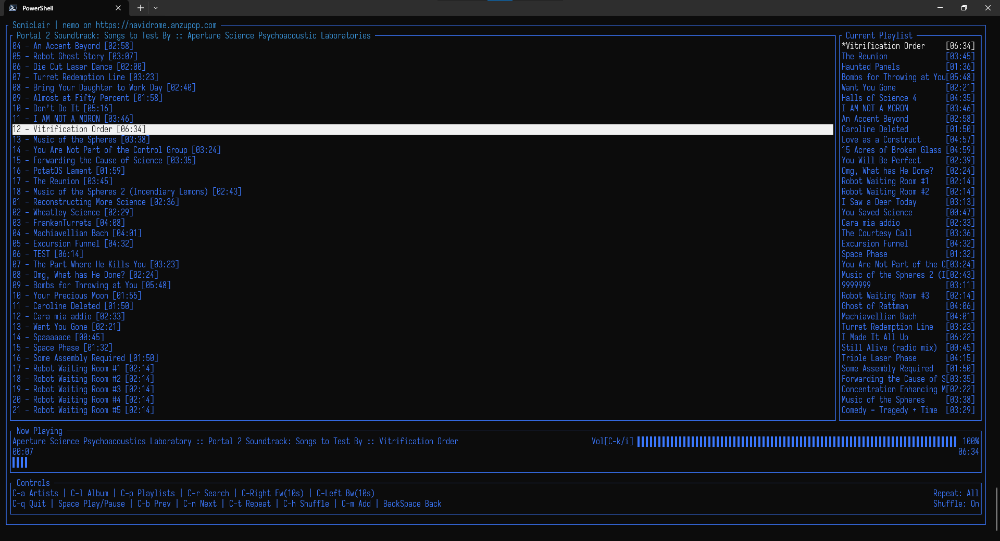

# Soniclair.NET

   

## An album-centered subsonic client for the Terminal

SonicLair.Cli is a terminal music client for subsonic compatible music servers built using .net Core 6, designed to run in the terminal (Windows, Linux and macOS).

## Features

- Connect to any subsonic-compatible music server. Tested on Navidrome.
- Album-centered music playing: if you start playing a song, the album becomes your playlist.
- Start a radio based on any song on your library.
- Search throughout your entire music library.

## Screenshots for the Terminal

## Installation and Usage

### Terminal

The terminal version is an (almost) self contained executable. You can grab the version for your operating system from the releases page. Within the compressed file there is the excutable and (if applicable) the libvlc libraries needed for the audio backend to work. Please keep the directory structure as is.

### Linux caveats

For linux, the app will search for the relevant libvlc files from your installation.

For Ubuntu and Debian

    sudo apt update
    sudo apt upgrade (if you haven't done it in a while)
    sudo apt install libvlc-dev libx11-dev

And then you can try the app. If it complains that it can't instantiate libvlc try

    sudo apt install vlc

More info about this [here](https://github.com/videolan/libvlcsharp/blob/3.x/docs/linux-setup.md)

## Projects leveraged here

Soniclair is built upon

### Terminal

- [Terminal.GUI]

### Common

- [VLC] (as an audio backend)

## License

MIT, see LICENSE for more info.
But basically, you can do whatever you want with this code.

[//]: # "These are reference links used in the body of this note and get stripped out when the markdown processor does its job. There is no need to format nicely because it shouldn't be seen. Thanks SO - http://stackoverflow.com/questions/4823468/store-comments-in-markdown-syntax"
[terminal.gui]: https://github.com/migueldeicaza/gui.cs
