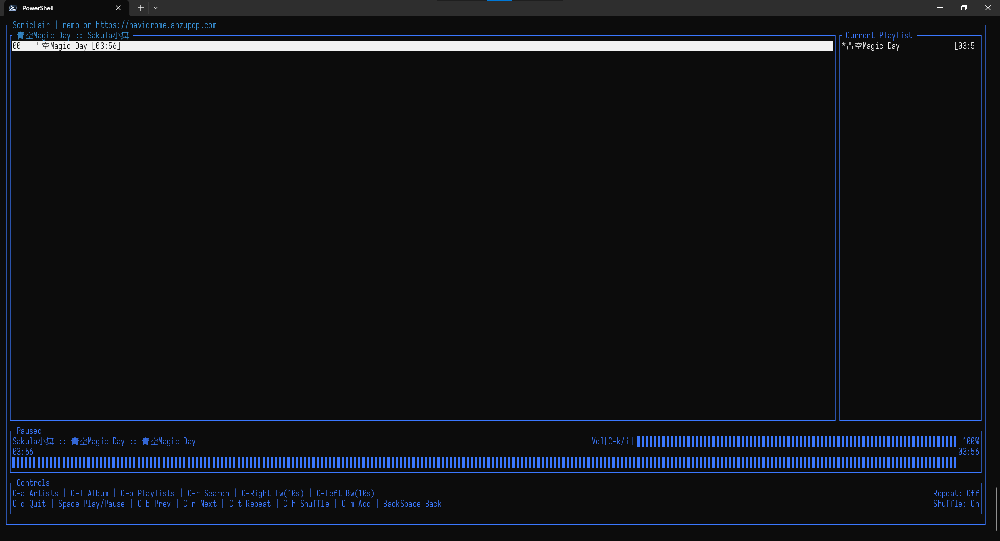

# Soniclair.Cli

[English](./README.md) [简体中文](./README.zh-CN.md)

<p align="middle">
   
</p>

## 一个以专辑为中心，运行在终端里的 Subsonic 客户端

SonicLair.Cli 是一个使用 .NET Core 6 构建的运行在终端里的 Subsonic 客户端，跨平台 (Windows, Linux 和 macOS)。 它从 [SonicLair.Net](https://github.com/thelinkin3000/SonicLair.NET) 分叉。

## 特点

- 连接到任何使用 Subsonic 协议的音乐服务器（在 Navidrome 上测试）。
- 以专辑为中心：你开始播放音乐时，自动将所属专辑作为播放列表。
- 搜索你的整个音乐库。
<!-- - Start a radio based on any song on your library. -->

## 截屏

<p align="middle">



</p>

## 安装和使用

[](https://github.com/xiongnemo/SonicLair.Cli/releases)

提供的可执行文件（几乎）不需要别的依赖。你可以直接从 Release 页面下载对应你的操作系统的版本。在压缩文件中有可执行文件和使得音频后端能运作的 libvlc 库（如果有）。请不要更改目录结构。

如果你在 Windows 上且已经有了 [scoop](https://github.com/ScoopInstaller/Scoop)，你也可以这么安装：

```powershell
scoop bucket add nemo https://github.com/xiongnemo/windows-binaries-scoop-bucket && scoop install SonicLair.Cli
```

### Linux

对于 Linux，应用程序会自动搜索 libvlc。

对 Ubuntu 和 Debian：
```bash
sudo apt update && sudo apt upgrade # 如果你有好一会儿都没干过了
sudo apt install libvlc-dev libx11-dev
```
然后就可以使用了！如果它跟你说它无法实例化 libvlc 的话，可以试试
```bash
sudo apt install vlc
```
更多内容请参考 [这里](https://github.com/videolan/libvlcsharp/blob/3.x/docs/linux-setup.md)

## 该项目使用了

### 终端界面

- [Terminal.GUI]

### 音频后端

- [VLC]

## 源代码许可

MIT

[vlc]: https://www.videolan.org/
[terminal.gui]: https://github.com/migueldeicaza/gui.cs
